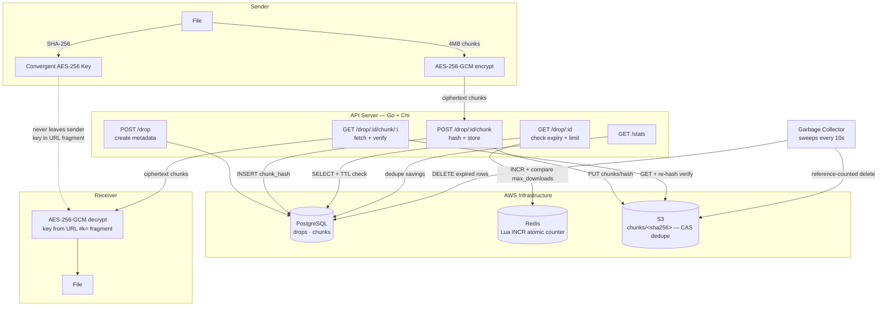

# CodeDrop

[](https://pkg.go.dev/github.com/sumanthd032/codedrop)
[](https://opensource.org/licenses/MIT)
[](https://www.npmjs.com/package/codedrop)
[](https://www.npmjs.com/package/codedrop)
[](https://github.com/sumanthd032/CodeDrop/releases/latest)
[](https://github.com/sumanthd032/CodeDrop/actions)
[](https://go.dev/dl/)

> CodeDrop enables developers to securely and temporarily hand off code artifacts via a CLI using client-side encryption, strict lifecycle policies, and content-addressed storage — without permanent storage or UI surfaces.

CodeDrop is an **ephemeral transfer primitive**, not a repository.

---

## The Problem

Developers constantly need to hand off build artifacts, logs, or quick patches. Existing tools violate basic engineering hygiene:

- **Google Drive / Slack:** Permanent storage for temporary needs, no enforced expiration and too slow.
- **Pastebin / Public Links:** No strong access limits or cryptographic confidentiality.
- **Server-Side Encryption:** The provider holds the keys and can read your data.

**CodeDrop solves handoff, not storage.**

---

## Core Features

- **Client-Side Convergent Encryption:** Files are chunked and encrypted locally via AES-256-GCM. The server never sees plaintext or keys.
- **Content-Addressed Storage (CAS):** Encrypted chunks deduplicated via SHA-256 hashing — up to 30% storage savings.
- **Atomic Lifecycle Enforcement:** Strict download limits enforced via Redis Lua scripts.
- **Zero Data Retention:** Garbage Collector destroys chunks and metadata immediately upon expiration.
- **AWS-Backed Infrastructure:** API server, PostgreSQL, Redis, and S3 storage all run on AWS.
- **Stream-First CLI UX:** Pipe-friendly and scriptable. No UI dashboards.

---

## Architecture

| Layer | Technology |
|---|---|
| CLI | Go + Cobra (chunking & AES-GCM encryption) |
| API Server | Go + Chi Router (stateless policy enforcement) |
| Metadata | PostgreSQL (AWS RDS) |
| Counters | Redis (AWS ElastiCache) |
| Storage | AWS S3 |



> The server only ever handles ciphertext and hashes. Encryption, decryption, and the key itself stay on the sender's and receiver's machines — the key travels solely in the URL fragment (`#k=...`), which HTTP clients never transmit to a server.

---

## Installation

### Option 1 — npm (recommended)

Works on Linux, macOS, and Windows. Requires Node.js 16+.

```bash
npm install -g codedrop
```

### Option 2 — Direct Binary Download

**Linux / macOS:**

```bash
# Replace linux-amd64 with your platform:
# linux-amd64, linux-arm64, darwin-amd64, darwin-arm64

curl -L https://github.com/sumanthd032/CodeDrop/releases/latest/download/codedrop-linux-amd64 -o codedrop
chmod +x codedrop
sudo mv codedrop /usr/local/bin/codedrop
```

Or with wget:

```bash
wget https://github.com/sumanthd032/CodeDrop/releases/latest/download/codedrop-linux-amd64
chmod +x codedrop-linux-amd64
sudo mv codedrop-linux-amd64 /usr/local/bin/codedrop
```

**Windows (PowerShell):**

```powershell
# Download the binary
Invoke-WebRequest -Uri "https://github.com/sumanthd032/CodeDrop/releases/latest/download/codedrop-windows-amd64.exe" -OutFile "codedrop.exe"

# Move it somewhere on your PATH, e.g.:
Move-Item codedrop.exe "$env:USERPROFILE\AppData\Local\Microsoft\WindowsApps\codedrop.exe"
```

Or simply download `codedrop-windows-amd64.exe` from the [Releases page](https://github.com/sumanthd032/CodeDrop/releases/latest) and run it directly from Command Prompt or PowerShell.

---

## Usage

### Push a file

Encrypt and upload a file with strict lifecycle policies:

```bash
codedrop push secret_build.zip
```

With custom expiry and download limit:

```bash
codedrop push secret_build.zip --expire 1h --max-views 2
```

**Flags:**

| Flag | Default | Description |
|---|---|---|
| `--expire`, `-e` | `24h` | Time until drop is permanently deleted (e.g. `30m`, `6h`, `24h`) |
| `--max-views`, `-m` | `1` | Maximum number of times the file can be downloaded |

On success, you get a secure URL:

```
Secure URL : http://13.62.52.168:8080/drop/a1b2c3d4#k=base64key...
Expires At : Apr 07, 2026 08:00:00 IST
Max Views  : 1
```

> **WARNING:** Anyone with this URL can decrypt the file. The key is in the URL fragment and cannot be recovered if lost.

### Pull a file

Download, verify integrity, and decrypt locally. Put the URL in quotes to prevent shell fragment parsing:

```bash
codedrop pull "http://13.62.52.168:8080/drop/a1b2c3d4#k=base64key..."
```

The file is saved as `downloaded_<original_filename>` in your current directory.

### Stats

View real-time observability data including storage saved by CAS deduplication:

```bash
codedrop stats
```

### Custom Server

Point to a different CodeDrop server via flag or environment variable:

```bash
# Via flag
codedrop push file.zip --server http://your-server:8080

# Via environment variable
export CODEDROP_SERVER=http://your-server:8080
codedrop push file.zip
```

---

## Local Development Setup

### Prerequisites

- [Go 1.21+](https://go.dev/dl/)
- [Docker Desktop](https://www.docker.com/products/docker-desktop/)

### 1. Start Infrastructure

CodeDrop relies on Postgres, Redis, and MinIO (local S3). Start them using Docker Compose:

```bash
docker compose up -d
```

### 2. Start API Server

```bash
go run cmd/server/main.go
```

The server automatically runs database migrations and connects to Redis/MinIO on startup.

### 3. Build CLI

```bash
go build -o codedrop cmd/cli/main.go

# Optional: move to PATH
sudo mv codedrop /usr/local/bin/
```

### 4. Test locally

```bash
# Point CLI at local server
export CODEDROP_SERVER=http://localhost:8080

codedrop push myfile.zip
codedrop pull "http://localhost:8080/drop/<id>#k=<key>"
```

---

## Security & Threat Model

**Honest-but-Curious Server:** CodeDrop assumes the server infrastructure is compromised. Because of client-side encryption, the server only ever hosts mathematical garbage.

**URL Fragment Key Distribution:** The decryption key is appended to the URL as a fragment (`#k=...`). Browsers and HTTP clients never transmit fragments to the server. The key strictly remains on the sender and receiver's machines.

**Convergent Encryption Paradox:** Standard E2EE breaks deduplication (CAS). CodeDrop solves this by deriving the encryption key and AES-GCM nonce from the SHA-256 hash of the local file. Identical files produce identical ciphertext, allowing the server to deduplicate without ever knowing the plaintext.

---

## License

[MIT](LICENSE)
